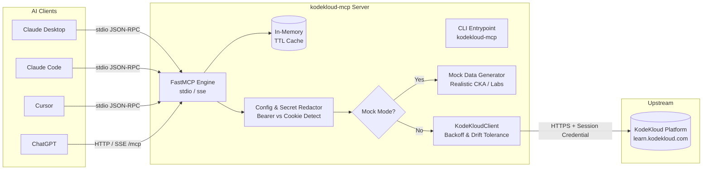

# kodekloud-mcp

[](https://github.com/kodekloud-community/kodekloud-mcp/actions/workflows/ci.yml)
[](https://opensource.org/licenses/MIT)
[](https://www.python.org/downloads/)
[](https://modelcontextprotocol.io/)

A production-quality, open-source [Model Context Protocol (MCP)](https://modelcontextprotocol.io/) server that connects your personal [KodeKloud](https://kodekloud.com) learning account to AI assistants—including **Claude Desktop**, **Claude Code**, **Cursor**, and **ChatGPT**.

Review course completion, inspect syllabus outlines, view active hands-on labs, track certification exam readiness (CKA, CKAD, CKS, Terraform), and generate personalized weekly study schedules directly from inside your AI chat client.

---

> [!CAUTION]
> **DISCLAIMER & TERMS OF SERVICE NOTICE**
> 
> **`kodekloud-mcp` is an independent, unofficial community project.** It is **not** affiliated, associated, authorized, endorsed by, or in any way officially connected with KodeKloud, its subsidiaries, or its affiliates. The official KodeKloud website is available at [https://kodekloud.com](https://kodekloud.com).
>
> This tool is intended solely for **personal educational use** by authenticated KodeKloud account holders querying their own learning statistics. Users must strictly abide by [KodeKloud's Terms of Service](https://kodekloud.com/terms-of-service/). Do not use this tool to scrape unauthorized content, share subscription access, or bypass platform safeguards.

---

## Table of Contents

1. [Features](#features)
2. [Architecture & Security Principles](#architecture--security-principles)
3. [MCP Tools & Prompts Reference](#mcp-tools--prompts-reference)
4. [Authentication & Session Credential Guide](#authentication--session-credential-guide)
   - [Chrome DevTools](#extracting-credentials-in-google-chrome)
   - [Firefox DevTools](#extracting-credentials-in-firefox)
   - [Discovering Endpoints & Sanitizing HAR Traces](#discovering-endpoints--sanitizing-har-traces)
5. [Installation & Quick Start](#installation--quick-start)
   - [Run Instantly with uvx](#1-run-instantly-with-uvx-recommended)
   - [Install via pip](#2-install-via-pip)
   - [Run with Docker & Docker Compose](#3-run-with-docker--docker-compose)
6. [Client Configuration](#client-configuration)
   - [Claude Desktop](#claude-desktop)
   - [Claude Code CLI](#claude-code-cli)
   - [Cursor IDE](#cursor-ide)
   - [ChatGPT (Remote SSE Connector)](#chatgpt-remote-sse-connector)
7. [Deployment Guide](#deployment-guide)
   - [Personal Deployment (Local stdio vs Remote SSE)](#personal-deployment)
   - [Architecture for the KodeKloud Community](#architecture-for-the-kodekloud-community)
   - [Open Source Publishing Checklist](#open-source-publishing-checklist)
8. [Troubleshooting & Logs](#troubleshooting--logs)
9. [Security Best Practices](#security-best-practices)

---

## Features

- **Read-Only by Default**: Safeguards your account against unintentional state changes.
- **Offline Mock Mode (`KODEKLOUD_USE_MOCK=true`)**: Ships enabled by default so you can test the entire server, inspect tool structures, and run tests immediately without real credentials.
- **Dual Transport Protocols**:
  - `stdio`: Lightning-fast, private local communication for Claude Desktop, Claude Code, and Cursor.
  - `sse` / `streamable-http`: Modern streaming HTTP transport for remote agents, webhooks, and ChatGPT connectors.
- **Credential Auto-Detection**: Accepts either a raw browser `Cookie` string or a `Bearer` JWT token. Formats appropriate headers automatically.
- **Strict Credential Redaction**: Automatically scrubs authentication cookies, bearer tokens, and JWTs from all logs and error messages.
- **Resilient Network Handling**:
  - Automatic exponential backoff with jitter on HTTP 429 (Rate Limiting), respecting upstream `Retry-After` headers.
  - Graceful degradation on schema drift (API structural variations never crash the server).
  - In-memory async-safe TTL caching (default 60s) to avoid spamming KodeKloud servers.
  - User-friendly error messaging for expired sessions (HTTP 401/403).

---

## Architecture & Security Principles



1. **Stdio Protocol Sanctity**: MCP clients communicate with the server over `stdout`. **All operational logs, warnings, and error traces are strictly written to `stderr`**.
2. **Zero Persistent Storage of Secrets**: The server does not write session credentials to disk, databases, or cache files. Credentials live exclusively in runtime process memory.
3. **Endpoint Isolation**: Upstream endpoints and response parsers are isolated in `src/kodekloud_mcp/kodekloud_client.py` with clearly designated `TODO` markers.

---

## MCP Tools & Prompts Reference

### Available Tools

| Tool Name | Type | Description | Key Arguments |
| :--- | :--- | :--- | :--- |
| `get_course_progress` | Read | Fetch percentage completed, labs completed vs total, and last activity timestamp. | `course_name` *(optional string)* |
| `list_enrolled_courses` | Read | List enrolled courses, categories, difficulty, and status (`In Progress`, `Completed`, `Not Started`). | *None* |
| `get_course_outline` | Read | Retrieve syllabus modules, lectures, lab exercises, and the immediate **next suggested lesson**. | `course_name` *(required string)* |
| `get_active_labs` | Read | Check currently running, paused, or stopped interactive labs with remaining time. | *None* |
| `get_certifications` | Read | View active certification paths (CKA, CKAD, Terraform) and exam readiness percentages. | *None* |
| `get_learning_summary` | Read | Compact study digest: current & longest daily streak, total hours, and next suggested lesson. | *None* |
| `start_lab` | **Write** | Launch/provision an interactive hands-on lab environment. *(Disabled by default)* | `lab_id` *(required string)* |
| `stop_lab` | **Write** | Terminate an active lab session and clean up resources. *(Disabled by default)* | `lab_id` *(required string)* |

> [!NOTE]
> Write tools (`start_lab`, `stop_lab`) are registered **only** when `KODEKLOUD_ENABLE_WRITE_TOOLS=true` is set. In read-only mode, they do not appear in the tool catalog.

### Available Prompts

- **`study_plan(goal: str)`**:
  Directs the LLM to inspect your current progress (`get_learning_summary`), enrolled courses (`get_course_progress`), remaining syllabus outline (`get_course_outline`), and exam readiness (`get_certifications`) to generate a customized, week-by-week study roadmap with hands-on lab milestones.

---

## Authentication & Session Credential Guide

KodeKloud relies on authenticated browser sessions. You provide your credential via the `KODEKLOUD_SESSION_COOKIE` environment variable. The server auto-detects:
- Tokens starting with `Bearer ` or matching a JWT (`eyJ...`) are sent via `Authorization: Bearer <token>`.
- Any other string is sent as a `Cookie` header.

### Extracting Credentials in Google Chrome

1. Open Google Chrome and log into your account at [learn.kodekloud.com](https://learn.kodekloud.com).
2. Press `F12` (or `Cmd+Option+I` on macOS) to open **DevTools**.
3. Select the **Network** tab, check the **Fetch/XHR** filter, and refresh the page (`Ctrl+R` / `Cmd+R`).
4. Click on any authenticated request (e.g. `me`, `progress`, or `courses`).
5. In the **Headers** pane on the right:
   - Scroll down to **Request Headers**.
   - Look for `authorization`: If present, copy the full value starting with `Bearer eyJ...`
   - Look for `cookie`: If no Authorization header is present, copy the entire string after `cookie: ` (e.g., `_session_id=...; remember_token=...`).


### Extracting Credentials in Firefox

1. Open Firefox and log into [learn.kodekloud.com](https://learn.kodekloud.com).
2. Press `F12` (or `Cmd+Option+I` on macOS) to open the **Web Developer Tools**.
3. Go to the **Storage** tab -> expand **Cookies** -> select `https://learn.kodekloud.com`.
4. Copy the values of your session authentication cookies, or inspect the **Network** tab headers as described above.

### Discovering Endpoints & Sanitizing HAR Traces

Because KodeKloud does not have an official public REST documentation, community members can discover active endpoints:
1. In the browser DevTools **Network** tab, perform an action (e.g. view a course or check active labs).
2. Right-click the request list and select **Save all as HAR with content**.
3. **CRITICAL SANITIZATION STEP**: Open the `.har` file in a text editor. Use find-and-replace to sanitize:
   - Search for `Bearer` and replace the token with `Bearer REDACTED_TOKEN`.
   - Search for `cookie` and replace session values with `REDACTED_COOKIE`.
   - Search for your email address, real name, and IP address.
4. Compare your sanitized payload with the models in `src/kodekloud_mcp/models.py`, and submit an issue or PR!

---

## Installation & Quick Start

### 1. Run Instantly with uvx (Recommended)

[`uv`](https://docs.astral.sh/uv/) runs the MCP server directly in an isolated temporary virtual environment without requiring a manual install:

```bash
# Test in offline Mock Mode (default)
uvx kodekloud-mcp

# Connect with live session cookie (Linux / macOS)
export KODEKLOUD_SESSION_COOKIE="your_cookie_or_jwt_here"
export KODEKLOUD_USE_MOCK=false
uvx kodekloud-mcp

# Connect with live session cookie (Windows PowerShell)
$env:KODEKLOUD_SESSION_COOKIE="your_cookie_or_jwt_here"
$env:KODEKLOUD_USE_MOCK="false"
uvx kodekloud-mcp
```

### 2. Install via pip

```bash
# Install package from repository
pip install git+https://github.com/kodekloud-community/kodekloud-mcp.git

# Verify installation
kodekloud-mcp --help
```

### 3. Run with Docker & Docker Compose

The included `Dockerfile` builds a non-root, minimal runtime image.

#### Using Docker CLI:

```bash
# Build the container
docker build -t kodekloud-mcp .

# Run locally in stdio mode (interactive)
docker run -i --rm \
  -e KODEKLOUD_USE_MOCK=true \
  kodekloud-mcp --transport stdio

# Run as an HTTP/SSE server on port 8000
docker run -d --rm \
  -p 8000:8000 \
  -e KODEKLOUD_USE_MOCK=true \
  -e KODEKLOUD_SESSION_COOKIE="your_cookie" \
  kodekloud-mcp --transport sse --host 0.0.0.0 --port 8000
```

#### Using Docker Compose:

```bash
# Start background SSE server
docker compose up -d

# Check server logs
docker compose logs -f
```

---

## Client Configuration

### Claude Desktop

To connect `kodekloud-mcp` to Claude Desktop, edit your `claude_desktop_config.json`:

- **macOS**: `~/Library/Application Support/Claude/claude_desktop_config.json`
- **Windows**: `%APPDATA%\Claude\claude_desktop_config.json`
- **Linux**: `~/.config/Claude/claude_desktop_config.json`

```json
{
  "mcpServers": {
    "kodekloud": {
      "command": "uvx",
      "args": ["kodekloud-mcp"],
      "env": {
        "KODEKLOUD_SESSION_COOKIE": "your_cookie_or_jwt_here",
        "KODEKLOUD_USE_MOCK": "false",
        "KODEKLOUD_ENABLE_WRITE_TOOLS": "false",
        "KODEKLOUD_CACHE_TTL_SECONDS": "60"
      }
    }
  }
}
```

> [!TIP]
> If you do not have `uv` installed, replace `"command": "uvx"` with `"command": "python"` and pass `"-m", "kodekloud_mcp.cli"` in `"args"`.

### Claude Code CLI

Add `kodekloud-mcp` directly to your Claude Code workspace:

```bash
claude mcp add kodekloud -- uvx kodekloud-mcp
```

Or with live credentials:

```bash
claude mcp add kodekloud -e KODEKLOUD_SESSION_COOKIE="your_cookie" -e KODEKLOUD_USE_MOCK="false" -- uvx kodekloud-mcp
```

### Cursor IDE

In Cursor:
1. Open **Settings** -> **Features** -> **MCP Servers**.
2. Click **Add New MCP Server**.
3. Configure:
   - **Name**: `KodeKloud`
   - **Type**: `command`
   - **Command**: `uvx kodekloud-mcp`
   - Set environment variables `KODEKLOUD_SESSION_COOKIE` and `KODEKLOUD_USE_MOCK` in your project `.env` or system environment.

### ChatGPT (Remote SSE Connector)

For remote LLMs and ChatGPT Custom GPT Actions that require an HTTPS/SSE streaming URL:

1. Launch `kodekloud-mcp` in SSE mode behind a TLS reverse proxy (e.g., Caddy or Cloudflare Tunnel):
   ```bash
   kodekloud-mcp --transport sse --host 0.0.0.0 --port 8000
   ```
2. Endpoint URL for client connection: `https://mcp.yourdomain.com/sse` (or `https://mcp.yourdomain.com/mcp` for streamable HTTP).

---

## Deployment Guide

### Personal Deployment

For individual learners:
- **Recommended**: Run locally over `stdio`. It runs as a private subprocess on your computer, requires zero open ports, and keeps your session credentials strictly local.
- **Remote Personal Host**: If you prefer accessing your server from mobile or ChatGPT, deploy the Docker container to a personal VPS, Fly.io, or Google Cloud Run behind Caddy/Nginx enforcing HTTPS and basic auth.

### Architecture for the KodeKloud Community

> [!IMPORTANT]
> **Zero Multi-Tenancy Guarantee**:
> `kodekloud-mcp` is intentionally designed as an open-source package where **every learner runs their own instance with their own credential**.
> 
> **DO NOT build or host a shared multi-tenant service storing other users' session cookies.** Storing third-party session tokens introduces severe liability, risk of credential harvesting, and violates user trust.

If an organization or community team ever provides a hosted proxy service:
1. **In-Memory Per-Request Authentication Only**: Never write cookies to disk or databases. Transmit credentials per-request via client headers.
2. **Mandatory HTTPS**: Reject unencrypted plain HTTP connections.
3. **Per-User Rate Limiting**: Apply token-bucket rate limiting per IP/user to prevent upstream blocks.
4. **Privacy & Data Minimization**: Never record student learning histories or PII in centralized logging aggregators.

### Open Source Publishing Checklist

When releasing or maintaining community distributions:

- [x] **Semantic Versioning**: Adhere strictly to `MAJOR.MINOR.PATCH` in `pyproject.toml` and `CHANGELOG.md`.
- [x] **Git Release Tags**: Create signed git tags (`git tag -s v0.1.0 -m "Release v0.1.0"`).
- [x] **PyPI Trusted Publishing**: Use GitHub Actions OIDC Trusted Publishing (no static API tokens stored in repository secrets).
- [x] **Community Templates**: Include `.github/ISSUE_TEMPLATE/` for bug reports and feature requests.
- [x] **Security Disclosures**: Maintain [SECURITY.md](SECURITY.md) with a clear vulnerability reporting route.
- [x] **Contribution Guide**: Maintain [CONTRIBUTING.md](CONTRIBUTING.md) detailing test suites and sanitization procedures.

---

## Troubleshooting & Logs

### 1. Viewing Server Logs
Because `stdout` is reserved for JSON-RPC messages in `stdio` mode, all operational messages are emitted to `stderr`.

- In **Claude Desktop**: View logs at:
  - macOS: `tail -f ~/Library/Logs/Claude/mcp-server-kodekloud.log`
  - Windows: `Get-Content "$env:APPDATA\Claude\logs\mcp-server-kodekloud.log" -Wait`
- In **CLI / Shell**: When running directly, logs appear in your console terminal in real-time.

### 2. Session Expired (HTTP 401 / 403)
- **Symptom**: `KodeKloud session expired or rejected (HTTP 401/403). Your browser session credential is no longer valid.`
- **Cause**: KodeKloud sessions expire periodically or when you log out from another browser tab.
- **Solution**: Open Chrome/Firefox, log in to KodeKloud, copy the fresh cookie or Bearer token, and update `KODEKLOUD_SESSION_COOKIE`.

### 3. Rate Limit Exceeded (HTTP 429)
- **Symptom**: `KodeKloud API rate limit exceeded (HTTP 429). The request was automatically retried 3 times...`
- **Solution**: The server retries automatically with exponential backoff. Increase `KODEKLOUD_CACHE_TTL_SECONDS=120` to cache responses longer and reduce request frequency.

### 4. Claude Desktop Does Not Detect the Server
- **Solution**: Check that `uv` or `python` is in your system `PATH`. Restart Claude Desktop completely (`Cmd+Q` on macOS, or right-click tray icon and exit on Windows).

---

## Security Best Practices

1. **Treat Your Cookie as a Password**: Anyone with your session cookie can access your KodeKloud account. Never paste it in public forums, GitHub issues, or chat screenshots.
2. **Instant Invalidation**: If you suspect your cookie was exposed, simply log out of KodeKloud in your browser. This immediately terminates the server session.
3. **Never Commit `.env` Files**: The `.gitignore` file is pre-configured to ignore all `.env` files. Verify with `git status` before committing.
4. **Principle of Least Privilege**: Keep `KODEKLOUD_ENABLE_WRITE_TOOLS=false` unless you specifically require lab automation.

---

## License

This project is licensed under the MIT License. See [LICENSE](LICENSE) for full details.
